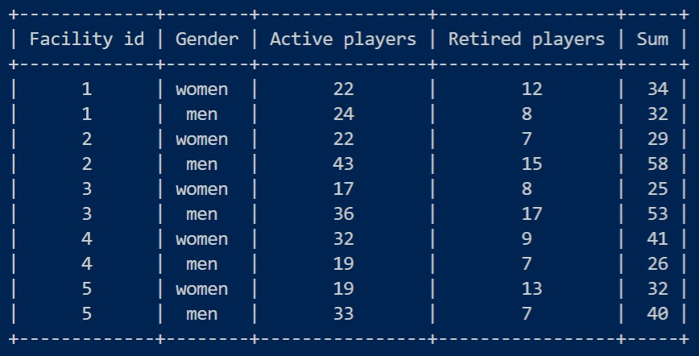
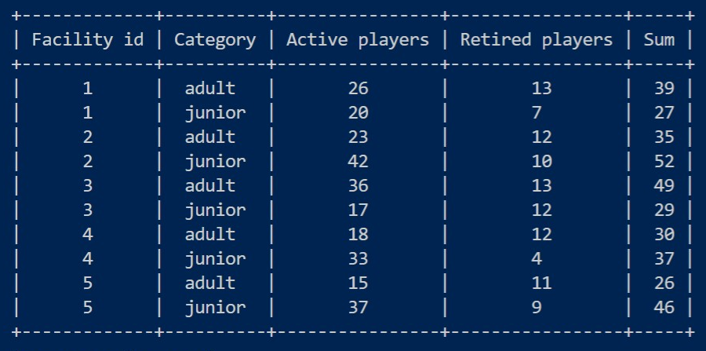
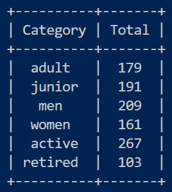

# Curling Masters Database 🥌

Database made in MySql for Canadian 🍁 curling sports club.

## What it contains
- Database scheme: tables & how they are connected.
- How to generate records and fill tables with them.
- Analysis of the generated data & report.
- Documentation.

## Number of players in the club

## Authors
[Edyta Łabędzka](https://github.com/3dytalabedzka)
[Katarzyna Turbańska](https://github.com/KatarzynaTurbanska)
[Iga Świtalska](https://github.com/IgaSwitalska)
